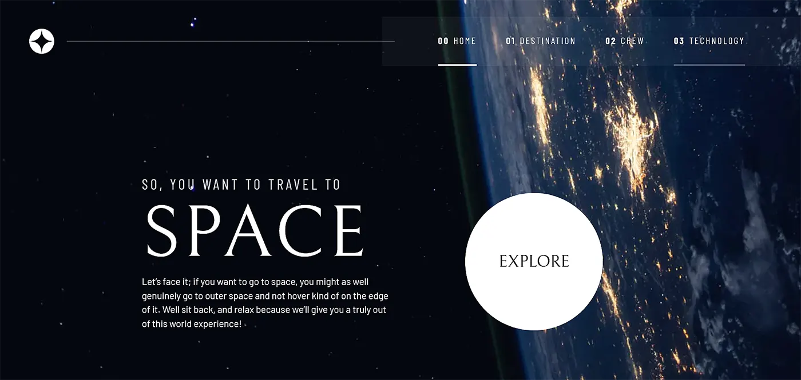

# Space tourism website - Frontend Mentor(reference)

### Links

- Live Site URL: https://tsharma95.github.io/spaceTourism/

## Table of contents

- [Overview](#overview)
  - [The challenge](#the-challenge)
  - [Screenshot](#screenshot)
  - [Links](#links)
- [My process](#my-process)
  - [Built with](#built-with)
  - [What I learned](#what-i-learned)
  - [Useful resources](#useful-resources)

## Overview

I used **Vanilla javascript** to change the content of the pages by fetching the data from the `json` local file
```js
eleId.textContent = jsonData[idField];
```

### The challenge

Users should be able to:
- View the optimal layout for each of the website's pages depending on their device's screen size
- See hover states for all interactive elements on the page
- View each page and be able to toggle between the tabs to see new information

### Screenshot



## My process

### Built with

- Semantic HTML5 markup
- CSS custom properties
- Flexbox
- CSS Grid
- Mobile-first workflow
- Accessibility workflow
- Vanilla Javascript

### What I learned


I was also able to learn more about `aria-attribute` and how to create a floating menu with it.

### Useful resources

- [Scrimba Course](https://scrimba.com/learn/spacetravel)
  

## **Have fun building!** 🚀
